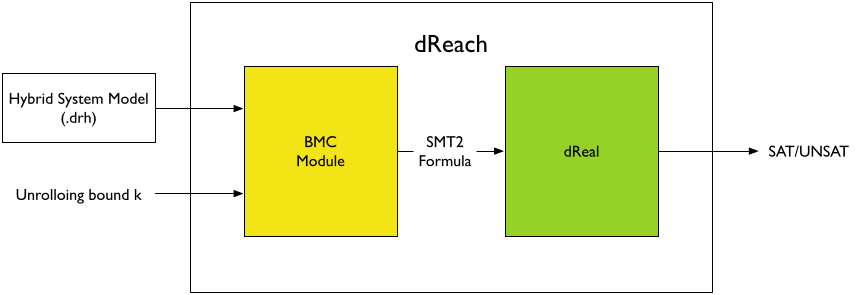

# dReach: Reachability Analysis for Nonlinear Hybrid Systems

**dReach** is a tool for safety verfication of hybrid systems. It answers questions of the type:

> a hybrid system ever run into an unsafe region?

This question can be encoded to SMT formulas, and answered by our solver **dReal**.

> **dReach** is able to handle general hyrbid systems with nonlinear differential equations and complex discrete mode-changes.

Since **dReal** implements a \\(\delta\\)-complete decision procedure, **dReach** performs "bounded \\(\delta\\)-complete reachability analysis".

---

### Bounded \\(\delta\\)-Reachability -- a brief explanation

Let \\(H = \langle X, Q, \mathsf{flow}, \mathsf{jump},
\mathsf{inv},\mathsf{init}\rangle\\) be a hybrid system, where
\\(\mathsf{flow}\\), \\(\mathsf{jump}\\), \\(\mathsf{inv}\\),
\\(\mathsf{init}\\) are SMT formulas that **dReal** can handle
(first-order formulas over the reals that allow polynomials,
trigonometric functions, exponential functions, Lipschitz-continuous
ODEs, etc.)

Now specify a numerical error bound \\(\delta\\), and recall that for
any formula \\(\varphi\\) we have defined a notion of
\\(\delta\\)-perturbation of \\(\varphi\\) (see the [dReal][dReal]
page), written as \\(\varphi^{\delta}\\). We can then define the
\\(\delta\\)-perturbation of \\(H\\) as:

[dReal]: http://dreal.cs.cmu.edu/

\\(H^{\delta} = \langle X, Q, {\mathsf{flow}}^{\delta}, {\mathsf{jump}}^{\delta}, {\mathsf{inv}}^{\delta}, {\mathsf{init}}^{\delta}\rangle\\),

by simply relaxing the logic formulas in the representation of
\\(H\\). Choose \\(n\in\mathbb{N}\\) to be a bound on the number of
discrete mode changes and \\(T\in \mathbb{R}^+\\) an upper bound on
the time duration. Let \\(\mathsf{unsafe}\\) encode a subset of
\\(X\times Q\\), the state space of \\(H\\). The bounded
\\(\delta\\)-reachability problem asks for one of the following
answers:

 - "safe": \\(H\\) cannot reach \\(\mathsf{unsafe}\\) in \\(n\\) steps within time \\(T\\).
 - "\\(\delta\\)-unsafe": \\(H^{\delta}\\) can reach \\({\mathsf{unsafe}}^{\delta}\\) in \\(n\\) steps within time \\(T\\).

<div class="center_img">
    
</div>

Note that these answers are not weaker than the precise ones. When
"safe" is the answer, we know for certain that \\(H\\) does not reach
the unsafe region; when "\\(\delta\\)-unsafe" is the answer, there
exists some \\(\delta\\)-bounded perturbation in the system that would
render it unsafe. The error-bound \\(\delta\\) can be chosen to be
sufficiently small so that the "\\(\delta\\)-unsafe" answer discovers
robustness problem in the system, which should consequently be
regarded as "unsafe" indeed.

---

## Example
### Input Format

Consider the following standard bouncing-ball example with the
 following assumptions:

 1. **Air Friction** acts on the ball, which is proportional to \\(D \cdot v\\).

 1. The ball is **partially elastic**. Whenever it hits the wall, it
    loses its velocity (\\(v' = K \times v\\)).

We model this example as the following hybrid system model ([bouncing_ball_with_drag.drh][bouncing_ball_with_drag.drh]):

[bouncing_ball_with_drag.drh]: archives/bouncing_ball_with_drag.drh

```drh
#define D 0.45
#define K 0.9
[0, 15] x;
[9.8] g;
[-18, 18] v;
[0, 3] time;

{ mode 1;

  invt:
        (v <= 0);
        (x >= 0);
  flow:
        d/dt[x] = v;
        d/dt[v] = -g + (- D * v ^ 1);
  jump:
        (x = 0) ==> @2 (and (x' = x) (v' = - K * v));
}
{
  mode 2;
  invt:
        (v >= 0);
        (x >= 0);
  flow:
        d/dt[x] = v;
        d/dt[v] = -g + (- D * v ^ 1);
  jump:
        (v = 0) ==> @1 (and (x' = x) (v' = v));
}
init:
@1	(and (x >= 5) (v = 0));

goal:
@1	(and (x >= 0.45));
```

 1. In the first part, we declare variables (\\(x\\) and \\(v\\)),
    constants g = 9.8, drag = 0.45, elasticity =
    0.9, and special variable **time** which is a bounded
    variable representing time in each mode.

 1. Then, we describe each mode of this hybrid system. Mode 1
    represents the status where a ball is falling down toward a floor,
    while mode 2 describes a ball bouncing back from a floor.

    1. **invt** describes the invariant of each mode. In this example,
       we have simple invariants -- velocity of the ball in mode 1
       should be negative since it's falling and the velocity of a
       ball should be positive in mode 2 because it's bouncing back
       from the floor.

    1. Dynamics of variables in each mode is described by **flow**,
    which is a set of differential equations. Here, we have simple
    dynamics: \\(\dot{x} = v\\) and \\(\dot{v} = -g \pm (D \times
    v) \\).

    1. **jump** describes the conditions to switch mode, the destination
    mode, and changes of values. Note that when it jumps from mode 1
    to mode 2, the velocity of the ball reduces due to the partial
    elasticity, \\(v' = K \times v \\).

 1. In the end, we describe the **initial condition**, and the **goal**
    which we want to check its **satisfiability**. In this example, we
    start with \\(x \ge 5\\) and \\(v = 0\\) and check whether it is
    possible to reach the mode 1 while \\(x >= 0.45\\).

### Bounded Model Checking

Our tool **dReach** takes in a hybrid system description (.drh) and unrolling bound \\(k\\),
and performs bounded model-checking.

    $ dReach -k 10 bouncing_ball.drh --visualize --precision=0.1

The command-line argument `-k 10` specify the unrolling depth of
bounded model checking. The options ``--visualize`` and ``--precision=0.1``
will be passed to dReal. 

 * The first option `--visualize` enables **dReal** to store
additional information to visualize the witness of \\(\delta\\)-sat result ([bouncing_ball_with_drag_10_0.smt2.json][bouncing_ball_with_drag_10_0.smt2.json]).
 * The second option `--precision` specifies the value of numerical
perturbation \\(\delta\\) we allow. 

Running the above command, it first generates
following .smt2 file ([bouncing_ball_with_drag_10_0.smt2][bouncing_ball_with_drag_10_0.smt2]):

[bouncing_ball_with_drag_10_0.smt2]: archives/bouncing_ball_with_drag_10_0.smt2

```smt2
(set-logic QF_NRA_ODE)
(declare-fun x () Real)
(declare-fun v () Real)
(declare-fun x_0_0 () Real)
(declare-fun x_0_t () Real)
...
(declare-fun x_10_0 () Real)
(declare-fun x_10_t () Real)
(declare-fun v_0_0 () Real)
(declare-fun v_0_t () Real)
...
(declare-fun v_10_0 () Real)
(declare-fun v_10_t () Real)
(declare-fun time_0 () Real)
...
(declare-fun time_10 () Real)
(declare-fun mode_0 () Real)
...
(declare-fun mode_10 () Real)
(define-ode flow_1 ((= d/dt[x] v) (= d/dt[v] (+ (- 0.000000 9.800000) (* -0.450000 (^ v 1.000000))))))
(define-ode flow_2 ((= d/dt[x] v) (= d/dt[v] (+ (- 0.000000 9.800000) (* -0.450000 (^ v 1.000000))))))
(assert (<= 0.000000 x_0_0))
(assert (<= x_0_0 15.000000))
...
(assert (<= -18.000000 v_10_t))
(assert (<= v_10_t 18.000000))
(assert (<= 0.000000 time_0))
(assert (<= time_0 3.000000))
...
(assert (<= 0.000000 time_10))
(assert (<= time_10 3.000000))
...
(assert (and (and (= v_0_0 0.000000) (>= x_0_0 5.000000)) (= mode_0 1.000000) (= [x_0_t v_0_t] (integral 0. time_0 [x_0_0 v_0_0] flow_1)) (= mode_0 1.000000) (forall_t 1.000000 [0.000000 time_0] (<= v_0_t 0.000000)) (<= v_0_t 0.000000) (<= v_0_0 0.000000) (forall_t 1.000000 [0.000000 time_0] (>= x_0_t 0.000000)) (>= x_0_t 0.000000) (>= x_0_0 0.000000) (= mode_1 2.000000) (= x_0_t 0.000000) (= v_1_0 (* -0.900000 v_0_t)) (= x_1_0 x_0_t) (= [x_1_t v_1_t] (integral 0. time_1 [x_1_0 v_1_0] flow_2)) (= mode_1 2.000000) (forall_t 2.000000 [0.000000 time_1] (>= v_1_t 0.000000)) (>= v_1_t 0.000000) (>= v_1_0 0.000000) (forall_t 2.000000 [0.000000 time_1] (>= x_1_t 0.000000)) (>= x_1_t 0.000000) (>= x_1_0 0.000000) (= mode_2 1.000000) (= v_1_t 0.000000) (= v_2_0 v_1_t) (= x_2_0 x_1_t) (= [x_2_t v_2_t] (integral 0. time_2 [x_2_0 v_2_0] flow_1)) (= mode_2 1.000000) (forall_t 1.000000 [0.000000 time_2] (<= v_2_t 0.000000)) (<= v_2_t 0.000000) (<= v_2_0 0.000000) (forall_t 1.000000 [0.000000 time_2] (>= x_2_t 0.000000)) (>= x_2_t 0.000000) (>= x_2_0 0.000000) (= mode_3 2.000000) (= x_2_t 0.000000) (= v_3_0 (* -0.900000 v_2_t)) (= x_3_0 x_2_t) (= [x_3_t v_3_t] (integral 0. time_3 [x_3_0 v_3_0] flow_2)) (= mode_3 2.000000) (forall_t 2.000000 [0.000000 time_3] (>= v_3_t 0.000000)) (>= v_3_t 0.000000) (>= v_3_0 0.000000) (forall_t 2.000000 [0.000000 time_3] (>= x_3_t 0.000000)) (>= x_3_t 0.000000) (>= x_3_0 0.000000) (= mode_4 1.000000) (= v_3_t 0.000000) (= v_4_0 v_3_t) (= x_4_0 x_3_t) (= [x_4_t v_4_t] (integral 0. time_4 [x_4_0 v_4_0] flow_1)) (= mode_4 1.000000) (forall_t 1.000000 [0.000000 time_4] (<= v_4_t 0.000000)) (<= v_4_t 0.000000) (<= v_4_0 0.000000) (forall_t 1.000000 [0.000000 time_4] (>= x_4_t 0.000000)) (>= x_4_t 0.000000) (>= x_4_0 0.000000) (= mode_5 2.000000) (= x_4_t 0.000000) (= v_5_0 (* -0.900000 v_4_t)) (= x_5_0 x_4_t) (= [x_5_t v_5_t] (integral 0. time_5 [x_5_0 v_5_0] flow_2)) (= mode_5 2.000000) (forall_t 2.000000 [0.000000 time_5] (>= v_5_t 0.000000)) (>= v_5_t 0.000000) (>= v_5_0 0.000000) (forall_t 2.000000 [0.000000 time_5] (>= x_5_t 0.000000)) (>= x_5_t 0.000000) (>= x_5_0 0.000000) (= mode_6 1.000000) (= v_5_t 0.000000) (= v_6_0 v_5_t) (= x_6_0 x_5_t) (= [x_6_t v_6_t] (integral 0. time_6 [x_6_0 v_6_0] flow_1)) (= mode_6 1.000000) (forall_t 1.000000 [0.000000 time_6] (<= v_6_t 0.000000)) (<= v_6_t 0.000000) (<= v_6_0 0.000000) (forall_t 1.000000 [0.000000 time_6] (>= x_6_t 0.000000)) (>= x_6_t 0.000000) (>= x_6_0 0.000000) (= mode_7 2.000000) (= x_6_t 0.000000) (= v_7_0 (* -0.900000 v_6_t)) (= x_7_0 x_6_t) (= [x_7_t v_7_t] (integral 0. time_7 [x_7_0 v_7_0] flow_2)) (= mode_7 2.000000) (forall_t 2.000000 [0.000000 time_7] (>= v_7_t 0.000000)) (>= v_7_t 0.000000) (>= v_7_0 0.000000) (forall_t 2.000000 [0.000000 time_7] (>= x_7_t 0.000000)) (>= x_7_t 0.000000) (>= x_7_0 0.000000) (= mode_8 1.000000) (= v_7_t 0.000000) (= v_8_0 v_7_t) (= x_8_0 x_7_t) (= [x_8_t v_8_t] (integral 0. time_8 [x_8_0 v_8_0] flow_1)) (= mode_8 1.000000) (forall_t 1.000000 [0.000000 time_8] (<= v_8_t 0.000000)) (<= v_8_t 0.000000) (<= v_8_0 0.000000) (forall_t 1.000000 [0.000000 time_8] (>= x_8_t 0.000000)) (>= x_8_t 0.000000) (>= x_8_0 0.000000) (= mode_9 2.000000) (= x_8_t 0.000000) (= v_9_0 (* -0.900000 v_8_t)) (= x_9_0 x_8_t) (= [x_9_t v_9_t] (integral 0. time_9 [x_9_0 v_9_0] flow_2)) (= mode_9 2.000000) (forall_t 2.000000 [0.000000 time_9] (>= v_9_t 0.000000)) (>= v_9_t 0.000000) (>= v_9_0 0.000000) (forall_t 2.000000 [0.000000 time_9] (>= x_9_t 0.000000)) (>= x_9_t 0.000000) (>= x_9_0 0.000000) (= mode_10 1.000000) (= v_9_t 0.000000) (= v_10_0 v_9_t) (= x_10_0 x_9_t) (= [x_10_t v_10_t] (integral 0. time_10 [x_10_0 v_10_0] flow_1)) (= mode_10 1.000000) (forall_t 1.000000 [0.000000 time_10] (<= v_10_t 0.000000)) (<= v_10_t 0.000000) (<= v_10_0 0.000000) (forall_t 1.000000 [0.000000 time_10] (>= x_10_t 0.000000)) (>= x_10_t 0.000000) (>= x_10_0 0.000000) (= mode_10 1.000000) (>= x_10_t 0.450000)))
(check-sat)
(exit)
```

**dReach** uses **dReal** to check \\(\delta\\)-satisfiability of the generated smt2 file.

[bouncing_ball_with_drag_10_0.smt2.json]: /archives/bouncing_ball_with_drag_10_0.smt2.json
[dReal]: index.html

### Result

Using the generated [bouncing_ball_with_drag_10_0.smt2.json] file, we can visualize a witness of \\(\delta\\)-sat case as follows:

<script src="/js/d3.v3.js"></script>
<script src="/js/underscore-min.js"></script>
<div id="chart-container" style="text-align:center">
<script type="text/javascript" src="/archives/bouncing_ball_with_drag_data.js"></script>
<script type="text/javascript" src="/js/vis.js"></script>
</div>

It shows that if the ball starts at a height between \\([8.720703125 , 8.73046875]\\)
, it can reach the height 0.45 after bouncing five times.
Note that we only specify the initial condition \\(x \ge 5\\) and
**dReal** found out the satisfying solution \\(
[8.720703125 , 8.73046875]\\)
by solving the encoded constraints.
