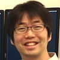
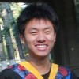
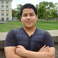
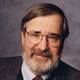
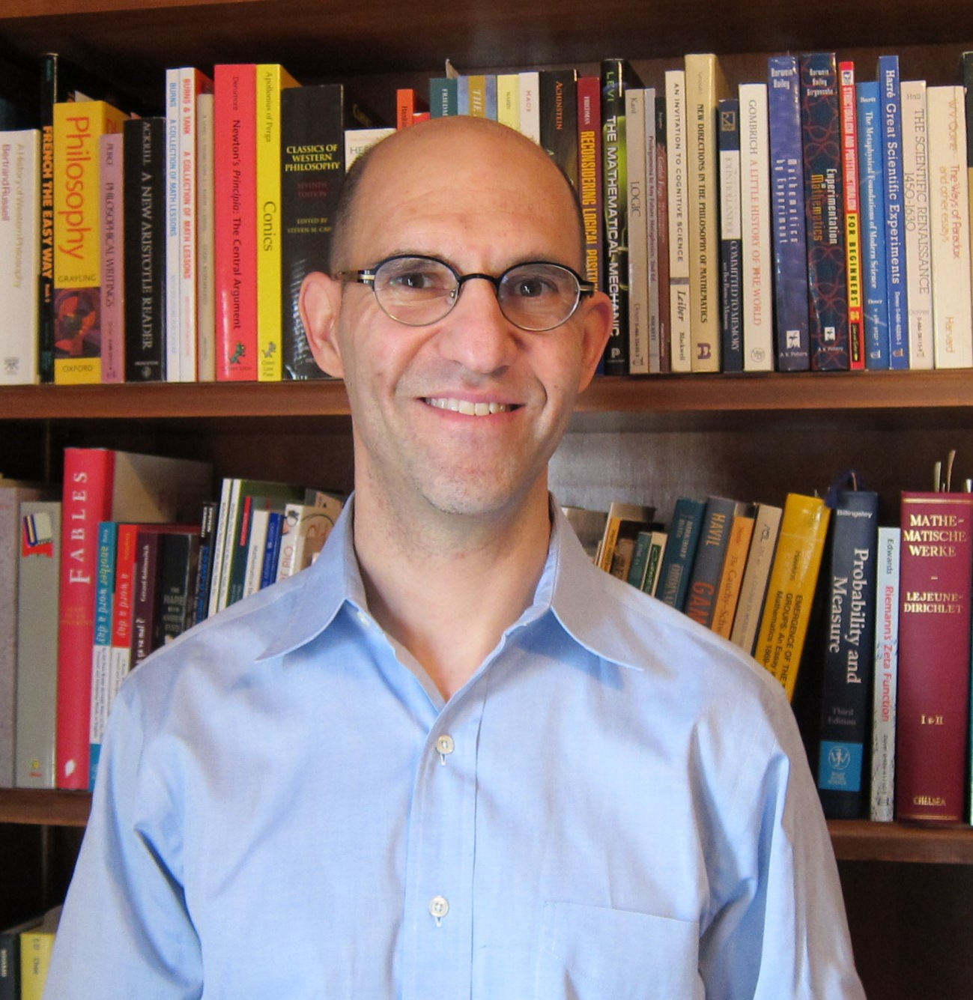
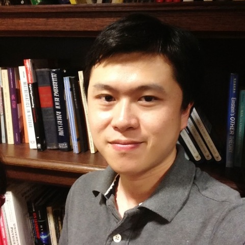

People
============

[Sicun Gao][sean]
(Postdoc Researcher, Computer Science Department, CMU)

[Soonho Kong][soonho]
(PhD Candidate, Computer Science Department, CMU)

[Wei Chen][wei]
(Master Student, Institute for Software Research, CMU)

[Mark Erazo][mark]
(Research Associate, Computer Science Department, CMU)

 [Edmund Clarke][emc]
(Professor, Computer Science Department, CMU)

[sean]:   http://www.cs.cmu.edu/~sicung
[soonho]: http://www.cs.cmu.edu/~soonhok
[wei]:    http://andrew.cmu.edu/~weichen1
[mark]:   http://www.cs.cmu.edu/directory/mark-erazo
[emc]:    http://www.cs.cmu.edu/~emc

Collaborators
--------------

[Jeremy Avigad][jeremy]
(Professor, Department of Philosophy, CMU)

[Bing Liu][bing]
(Postdoc Researcher, University of Pittsburgh)

[jeremy]: http://www.andrew.cmu.edu/~avigad
[bing]: http://www.cs.cmu.edu/~liubing
